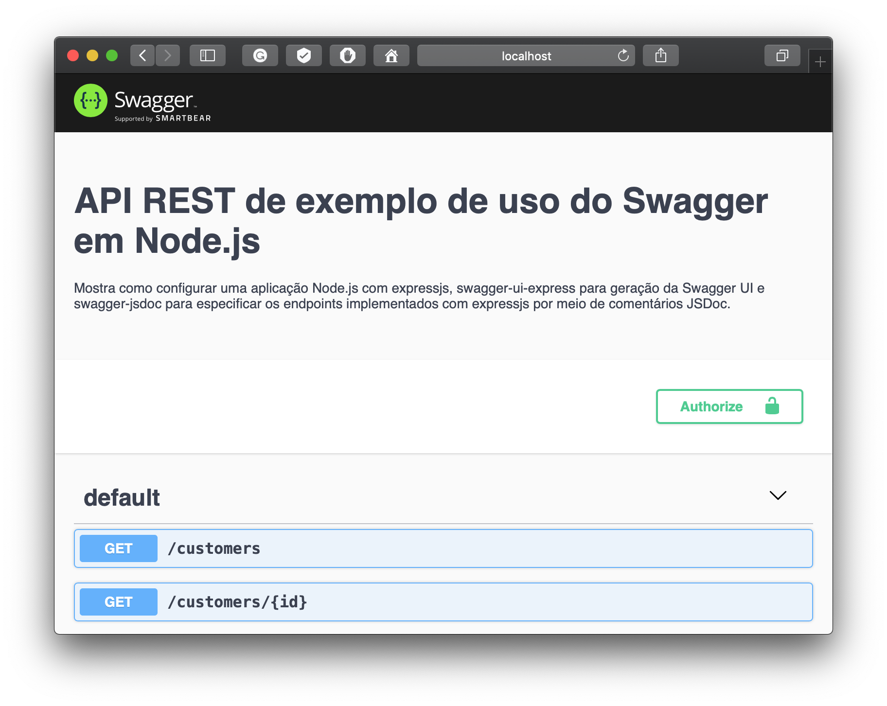

# Hello World com Node.js, expressjs, swagger-express-ui e swagger-jsdoc

Mostra como criar uma aplicação de exemplo Node.js com [expressjs](http://expressjs.com)
e [swagger-ui-express](https://github.com/scottie1984/swagger-ui-express)
para gerar a interface web do Swagger para teste e documentação 
de APIs REST.



Inclui o módulo [swagger-jsdoc](https://github.com/Surnet/swagger-jsdoc)
para permitir especificar os endpoints implementados
com expressjs por meio de comentários [JSDoc](https://jsdoc.app/).

## Instalação

```bash
npm install
```

## Execução

```bash
npm start
```
    